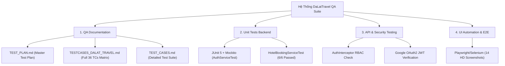
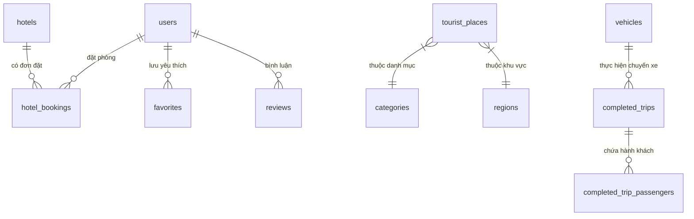

# 🌲 DaLatTravel - Hệ Thống Du Lịch Đà Lạt Thông Minh & Kết Nối Ghép Xe (Smart Tourism & Carpooling Platform)


---

## 📌 GIỚI THIỆU DỰ ÁN (PROJECT OVERVIEW)

**DaLatTravel** là hệ thống du lịch thông minh toàn diện thiết kế riêng cho thành phố Đà Lạt, kết hợp giữa **Thuật toán Tối ưu Lịch trình Du lịch (Traveling Salesman Problem - TSP)**, **Định tuyến thực tế (OSRM Routing API)**, **Hệ thống Ghép xe đi chung tiết kiệm**, **Đặt phòng Khách sạn thời gian thực**, **Xác thực Google Identity OAuth2** và **Trang Quản trị Admin phân quyền (RBAC)**.

Dự án được xây dựng chuẩn kiến trúc **Spring MVC Monolithic**, áp dụng bộ **Hồ sơ Kiểm thử Toàn diện QA/QC & Unit Test tự động (PASSED 100%)**.

---

## 🧪 PHÂN HỆ KIỂM THỬ TOÀN DIỆN & QUẢN LÝ CHẤT LƯỢNG (QA & TESTING PORTFOLIO)

Dự án được tích hợp bộ **Suite Kiểm Thử Toàn Diện (Fullstack QA & Automation Suite)** chuyên nghiệp dành riêng cho Hồ sơ xin việc Tester / QA / QC / Fullstack Developer:



### 📄 1. Bộ Tài Liệu Quy Chuẩn Kiểm Thử (QA Documentation)
- 📘 **Master Test Plan ([TEST_PLAN.md](TEST_PLAN.md)):** Kế hoạch kiểm thử tổng thể quy định phạm vi, môi trường, tiêu chí Entry/Exit Criteria và chiến lược Black-box / White-box / Gray-box.
- 📋 **Ma Trận Test Cases Chi Tiết ([TESTCASES_DALAT_TRAVEL.md](TESTCASES_DALAT_TRAVEL.md) & [TEST_CASES.md](TEST_CASES.md)):** Thiết kế ma trận 36+ kịch bản kiểm thử áp dụng kỹ thuật Phân vùng tương đương (Equivalence Partitioning) và Phân tích giá trị biên (Boundary Value Analysis).

### 💻 2. Kiểm Thử Đơn Vị Backend - Hộp Trắng (White-box Unit Tests)
- **Công cụ:** JUnit 5, Mockito (`@Mock`, `@InjectMocks`, `when().thenReturn()`).
- **Mã nguồn test:**
  - `AuthServiceTest.java`: Test độc lập logic Đăng ký, Đăng nhập, băm mật khẩu SHA-256, kiểm tra trùng Username/Email.
  - `HotelBookingServiceTest.java`: Test độc lập logic tính tổng tiền đặt phòng theo đêm, xử lý biên Check-out <= Check-in.
- **Kết quả:** `6/6 Unit Tests PASSED (100% Pass Rate)`, `BUILD SUCCESS`.

### 🛡️ 3. Kiểm Thử An Toàn & Bảo Mật (Security & RBAC Testing)
- **Chống Truy Cập Trái Phép (`AuthInterceptor`):** Tự động chặn và chuyển hướng khách chưa đăng nhập hoặc user thường cố truy cập `/admin`.
- **Đăng Nhập Google Identity Services (OAuth2):** Xác thực an toàn bằng JWT ID Token decode.
- **Chống SQL Injection & XSS:** Kiểm thử chèn mã độc tại các form tìm kiếm và đặt phòng.

---

## 📸 THƯ VIỆN GIAO DIỆN & TÍNH NĂNG (FEATURE GALLERY)

### 1. 🏠 Trang Chủ Du Lịch Đà Lạt (Homepage)
*Giao diện hiện đại, chuẩn Responsive, hiển thị danh mục Địa điểm nổi bật, Khách sạn sang trọng, Quán ăn đặc sản và Cẩm nang du lịch.*


---

### 2. 🗺️ Thuật Toán Lên Lịch Trình Tự Động & Bản Đồ OSRM (Trip Planner & Route Optimization)
*Tự động lập lịch trình du lịch tối ưu dựa trên thời gian, sở thích và vị trí GPS. Định tuyến đường đi thực tế (km, phút) với OpenStreetMap OSRM và hiển thị Polyline trên bản đồ tương tác LeafletJS.*

| 📋 Form Chọn Tiêu Chí Lịch Trình | 📍 Kết Quả Lập Lịch Trình & Bản Đồ OSRM |
| :---: | :---: |
|  |  |

---

### 3. 🚗 Nền Tảng Ghép Xe Đi Chung (Carpooling System)
*Kết nối tài xế và du khách có chung lộ trình (TP.HCM, Sân bay Liên Khương, Đà Lạt), hỗ trợ lọc theo tuyến và tiết kiệm chi phí di chuyển.*


---

### 4. 🏔️ Khám Phá Địa Điểm, Khách Sạn & Nhà Hàng (Discovery Modules)
*Hiển thị 50+ địa điểm tham quan, 10 khách sạn resort và 12 nhà hàng ẩm thực với hình ảnh HD sắc nét, số sao đánh giá và bộ lọc tìm kiếm.*

| 🏞️ Địa Điểm Du Lịch (50+ Spots) | 🏨 Khách Sạn & Resort | 🍲 Nhà Hàng & Quán Ăn |
| :---: | :---: | :---: |
|  |  |  |

---

### 5. 🏨 Chức Năng Đặt Phòng Khách Sạn (Hotel Booking & Instant Calculation)
*Modal đặt phòng trực quan: Chọn ngày Check-in/Check-out, số khách, tự động tính tổng tiền theo đêm và cấp mã đặt phòng duy nhất dạng `DLBK-XXXX`.*

| 📝 Form Modal Đặt Phòng | ✅ Đặt Phòng Thành Công (Code DLBK-XXXX) |
| :---: | :---: |
|  |  |

---

### 6. 🔐 Đăng Nhập Google OAuth2 & Phân Quyền Admin (Authentication & Security)
*Đăng nhập an toàn bằng Google Identity Services (OAuth2 JWT) hoặc tài khoản thường. Chặn bảo mật `AuthInterceptor` kiểm soát quyền truy cập tài nguyên `/admin`.*

| 🔑 Trang Đăng Nhập & Google Sign-In | 🛡️ Bảng Điều Khiển Admin Dashboard |
| :---: | :---: |
|  |  |

| 📋 Duyệt Đơn Đặt Phòng Admin | 🏨 Quản Lý Khách Sạn CRUD | 👥 Phân Quyền Người Dùng (RBAC) |
| :---: | :---: | :---: |
|  |  |  |

---

## 🗄️ CHI TIẾT CƠ SỞ DỮ LIỆU `dalattravel_db` (DATABASE SCHEMA - 23 TABLES)

Cơ sở dữ liệu MySQL `dalattravel_db` bao gồm **23 bảng dữ liệu chuẩn hóa 3NF** quản lý toàn bộ hệ sinh thái du lịch, đặt phòng và ghép xe:



### 📋 Bảng Kê 23 Bảng Cơ Sở Dữ Liệu & Chú Thích Chi Tiết:

| STT | Tên Bảng (Table Name) | Chức Năng & Mục Đích Sử Dụng Dữ Liệu |
| :---: | :--- | :--- |
| 1 | **`users`** | Quản lý thông tin tài khoản người dùng, băm mật khẩu SHA-256, thông tin Google OAuth2 và phân quyền hệ thống (`ADMIN`, `USER`). |
| 2 | **`tourist_places`** | Lưu trữ danh sách 50+ địa điểm du lịch Đà Lạt (Tên, mô tả, giá vé, số sao đánh giá, tọa độ Lat/Lng và đường dẫn ảnh HD). |
| 3 | **`attractions`** | Chi tiết các điểm tham quan nhỏ, hoạt động check-in chi tiết bên trong từng danh thắng lớn. |
| 4 | **`hotels`** | Danh sách Khách sạn, Homestay & Resort cao cấp (Địa chỉ, số điện thoại, giá phòng/đêm, tiện ích và hình ảnh). |
| 5 | **`hotel_bookings`** | Quản lý đơn đặt phòng khách sạn: Lưu mã `DLBK-XXXX`, ngày Check-in/Check-out, số khách, tổng tiền và trạng thái duyệt (`PENDING`, `CONFIRMED`, `CANCELLED`). |
| 6 | **`restaurants`** | Danh sách nhà hàng & quán ăn đặc sản Đà Lạt (Địa chỉ, khoảng giá trung bình, số điện thoại và loại hình ẩm thực). |
| 7 | **`categories`** | Danh mục phân loại địa điểm (Tham quan, Check-in, Ẩm thực, Văn hóa, Thiên nhiên, Giải trí). |
| 8 | **`regions`** | Phân loại địa lý khu vực hành chính tại Đà Lạt (Trung tâm, Phường 1, Trại Mát, Hồ Tuyền Lâm, Cầu Đất...). |
| 9 | **`completed_trips`** | Lưu trữ thông tin lịch sử các chuyến ghép xe đi chung đã hoàn thành (Lộ trình, tài xế, thời gian đến). |
| 10 | **`completed_trip_passengers`** | Danh sách hành khách từng đi trên các chuyến ghép xe đã hoàn thành. |
| 11 | **`pending_carpool_requests`** | Quản lý các yêu cầu đăng ký ghép xe đi chung đang chờ tài xế xác nhận hoặc chờ đủ số lượng người. |
| 12 | **`passengers`** | Thông tin chi tiết hành khách đăng ký tham gia dịch vụ ghép xe. |
| 13 | **`passenger_groups`** | Nhóm hành khách đăng ký cùng chuyến ghép xe đi theo nhóm/gia đình. |
| 14 | **`vehicles`** | Danh sách phương tiện di chuyển được đăng ký chạy dịch vụ ghép xe (Loại xe 4 chỗ, 7 chỗ, biển số, màu xe). |
| 15 | **`vehicle_pricing_configs`** | Cấu hình bảng giá cước ghép xe theo từng loại phương tiện và số kilômét di chuyển. |
| 16 | **`transport_options`** | Lưu các lựa chọn phương tiện di chuyển du lịch (Thuê xe máy, Ô tô tự lái, Xe đưa đón sân bay). |
| 17 | **`transport_price_histories`** | Ghi nhận lịch sử biến động giá cước thuê phương tiện theo mùa lễ hội/cao điểm. |
| 18 | **`festivals`** | Thông tin các sự kiện văn hóa, festival hoa Đà Lạt và lễ hội âm nhạc theo từng thời điểm trong năm. |
| 19 | **`blog_posts`** | Lưu trữ các bài viết cẩm nang du lịch, kinh nghiệm phượt Đà Lạt và hướng dẫn chọn trang phục. |
| 20 | **`favorites`** | Danh sách địa điểm du lịch & khách sạn yêu thích do người dùng thả tim / lưu lại. |
| 21 | **`reviews`** | Quản lý đánh giá số sao (1-5★) và lời bình luận trải nghiệm của du khách tại các địa điểm / khách sạn. |
| 22 | **`contacts`** | Lưu trữ tin nhắn phản hồi, góp ý và yêu cầu hỗ trợ từ du khách gửi đến Ban quản trị. |
| 23 | **`legacy_locations`** | Lưu trữ tọa độ mốc dữ liệu cũ và địa danh lịch sử Đà Lạt hỗ trợ thuật toán bản đồ. |

---

## 🛠️ CÔNG NGHỆ & KIẾN TRÚC HỆ THỐNG (TECH STACK & ARCHITECTURE)

- **Backend Core**: Java 21 LTS, Spring Boot 4.1.0, Spring Data JPA, Hibernate ORM.
- **Security & Auth**: Google Identity Services (OAuth2 JWT), SHA-256 Password Hashing, `AuthInterceptor` (Session-based RBAC protection).
- **Algorithms & APIs**: TSP (Traveling Salesman Problem) Greedy Route Optimization, OpenStreetMap OSRM REST Routing API.
- **Frontend & UI**: HTML5, Vanilla CSS, Bootstrap 5.3, FontAwesome 6, LeafletJS Interactive Maps.
- **Database**: MySQL 8.0 với InnoDB, UTF-8 Encoding (**23 Tables**).
- **Testing Suite**: JUnit 5, Mockito, Maven Test, Playwright / Browser E2E Automation.

---

## 🔑 BIẾN MÔI TRƯỜNG BẢO MẬT & CẤU HÌNH (ENVIRONMENT VARIABLES)

Truyền cấu hình bảo mật thông qua biến môi trường để chống rò rỉ secret lên Git repository:

```bash
export DB_URL="jdbc:mysql://localhost:3306/dalattravel_db?useSSL=false&serverTimezone=UTC&allowPublicKeyRetrieval=true&createDatabaseIfNotExist=true&characterEncoding=UTF-8"
export DB_USERNAME="root"
export DB_PASSWORD="your_secure_db_password"
export GOOGLE_CLIENT_ID="your_google_client_id.apps.googleusercontent.com"
```

---

## ⚙️ HƯỚNG DẪN CÀI ĐẶT & VẬN HÀNH (SETUP & OPERATION)

### 1. Khởi chạy MySQL Database
Tạo database MySQL:
```sql
CREATE DATABASE dalattravel_db CHARACTER SET utf8mb4 COLLATE utf8mb4_unicode_ci;
```

### 2. Chạy Unit Tests kiểm thử hệ thống
```powershell
.\mvnw.cmd test
```

### 3. Khởi chạy Backend Application (Spring Boot)
```powershell
.\mvnw.cmd spring-boot:run
```

Sau khi ứng dụng khởi chạy tại `http://localhost:8080`, du khách và quản trị viên có thể sử dụng các chức năng trực tiếp trên giao diện hoặc đăng nhập bằng tài khoản Quản trị viên/Tài khoản cá nhân Google Identity.

---

---

## 📁 CẤU TRÚC THƯ MỤC DỰ ÁN (PROJECT STRUCTURE)

```
DaLattravel/
├── docs/screenshots/               # Thư viện 14 ảnh chụp kiểm thử tính năng
├── src/main/java/com/example/dalattravel/
│   ├── config/                     # WebMvcConfig, AuthInterceptor, DataSeeder
│   ├── controller/                 # HomeController, TripPlannerController, HotelController, AdminController...
│   ├── model/                      # TouristPlace, Hotel, Restaurant, HotelBooking, User, Carpool... (26 Entities)
│   ├── repository/                 # Spring Data JPA Repositories
│   └── service/                    # AuthService, OsrmRouteService, TripPlannerService...
├── src/test/java/com/example/dalattravel/
│   ├── AuthServiceTest.java        # JUnit 5 Unit test cho Auth & Login
│   └── HotelBookingServiceTest.java# JUnit 5 Unit test cho Booking Calculation
├── TEST_PLAN.md                    # Master Test Plan Quy Chuẩn
├── TESTCASES_DALAT_TRAVEL.md       # Full 36 QA Test Cases Suite Matrix
├── TEST_CASES.md                   # Full QA Test Suite Document
└── README.md                       # Tài liệu giới thiệu dự án cho Nhà tuyển dụng
```

---

## 📝 GIẤY PHÉP & TÁC GIẢ (AUTHOR & LICENSE)

- **Đơn vị phát triển**: DaLatTravel Dev & QA Team.
- **Repository**: [https://github.com/buithanhanhvu/DaLattravel.git](https://github.com/buithanhanhvu/DaLattravel.git)
- **Bản quyền**: © 2026 Đà Lạt Travel System. All rights reserved.