# 🌲 DaLatTravel - Hệ Thống Du Lịch Đà Lạt Thông Minh & Kết Nối Ghép Xe (Smart Tourism & Carpooling Platform)


---

## 📌 GIỚI THIỆU DỰ ÁN (PROJECT OVERVIEW)

**DaLatTravel** là hệ thống du lịch thông minh toàn diện thiết kế riêng cho thành phố Đà Lạt, kết hợp giữa **Thuật toán Tối ưu Lịch trình Du lịch (Traveling Salesman Problem - TSP)**, **Định tuyến thực tế (OSRM Routing API)**, **Hệ thống Ghép xe đi chung tiết kiệm**, **Đặt phòng Khách sạn thời gian thực**, **Xác thực Google Identity OAuth2** và **Trang Quản trị Admin phân quyền (RBAC)**.

Dự án được xây dựng chuẩn kiến trúc **Spring MVC Monolithic**, áp dụng bộ **Hồ sơ Kiểm thử Toàn diện QA/QC & Unit Test tự động (PASSED 100%)**.

---

## 🧪 PHÂN HỆ KIỂM THỬ TOÀN DIỆN & QUẢN LÝ CHẤT LƯỢNG (QA & TESTING PORTFOLIO)

Dự án được tích hợp bộ **Suite Kiểm Thử Toàn Diện (Fullstack QA & Automation Suite)** chuyên nghiệp dành riêng cho Hồ sơ xin việc Tester / QA / QC / Fullstack Developer:

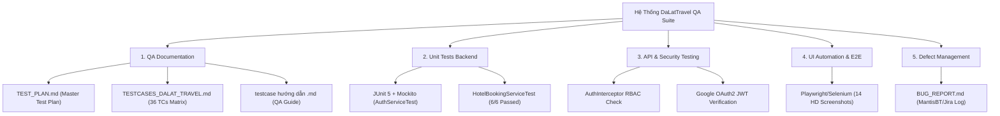

### 📄 1. Bộ Tài Liệu Quy Chuẩn Kiểm Thử (QA Documentation)
- 📘 **Master Test Plan ([TEST_PLAN.md](TEST_PLAN.md)):** Kế hoạch kiểm thử tổng thể quy định phạm vi, môi trường, tiêu chí Entry/Exit Criteria và chiến lược Black-box / White-box / Gray-box.
- 📋 **Ma Trận 36 Test Cases Chi Tiết ([TESTCASES_DALAT_TRAVEL.md](TESTCASES_DALAT_TRAVEL.md)):** Thiết kế ma trận 36 kịch bản kiểm thử áp dụng kỹ thuật Phân vùng tương đương (Equivalence Partitioning) và Phân tích giá trị biên (Boundary Value Analysis).
- 📗 **Kịch Bản Test Hướng Dẫn Chi Tiết ([testcase hướng dẫn .md](testcase%20h%C6%B0%E1%BB%9Bng%20d%E1%BA%ABn%20.md)):** Tài liệu hướng dẫn kịch bản từng phân hệ.
- 🐞 **Nhật Ký Báo Cáo & Theo Dõi Lỗi ([BUG_REPORT.md](BUG_REPORT.md)):** Quy trình ghi nhận và quản lý lỗi chuẩn MantisBT / Jira Defect Log (`BUG-001`, `BUG-002`, `BUG-003`).

### 💻 2. Kiểm Thử Đơn Vị Backend - Hộp Trắng (White-box Unit Tests)
- **Công cụ:** JUnit 5, Mockito (`@Mock`, `@InjectMocks`, `when().thenReturn()`).
- **Mã nguồn test:**
  - `AuthServiceTest.java`: Test độc lập logic Đăng ký, Đăng nhập, băm mật khẩu SHA-256, kiểm tra trùng Username/Email.
  - `HotelBookingServiceTest.java`: Test độc lập logic tính tổng tiền đặt phòng theo đêm, xử lý biên Check-out <= Check-in.
- **Kết quả:** `6/6 Unit Tests PASSED (100% Pass Rate)`, `BUILD SUCCESS`.

### 🛡️ 3. Kiểm Thử An Toàn & Bảo Mật (Security & RBAC Testing)
- **Chống Truy Cập Trái Phép (`AuthInterceptor`):** Tự động chặn và chuyển hướng khách chưa đăng nhập hoặc user thường cố truy cập `/admin`.
- **Đăng Nhập Google Identity Services (OAuth2):** Xác thực an toàn bằng JWT ID Token decode.
- **Chống SQL Injection & XSS:** Kiểm thử chèn mã độc tại các form tìm kiếm và đặt phòng.

---

## 📸 THƯ VIỆN GIAO DIỆN & TÍNH NĂNG (FEATURE GALLERY)

### 1. 🏠 Trang Chủ Du Lịch Đà Lạt (Homepage)
*Giao diện hiện đại, chuẩn Responsive, hiển thị danh mục Địa điểm nổi bật, Khách sạn sang trọng, Quán ăn đặc sản và Cẩm nang du lịch.*

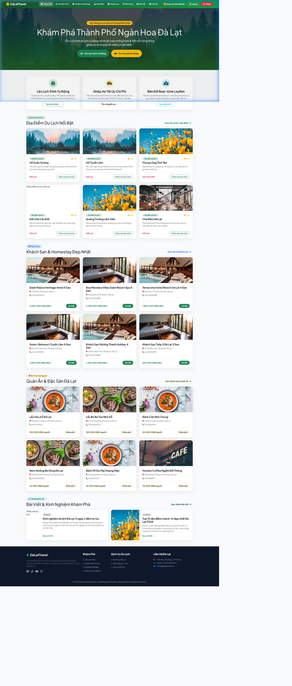

---

### 2. 🗺️ Thuật Toán Lên Lịch Trình Tự Động & Bản Đồ OSRM (Trip Planner & Route Optimization)
*Tự động lập lịch trình du lịch tối ưu dựa trên thời gian, sở thích và vị trí GPS. Định tuyến đường đi thực tế (km, phút) với OpenStreetMap OSRM và hiển thị Polyline trên bản đồ tương tác LeafletJS.*

| 📋 Form Chọn Tiêu Chí Lịch Trình | 📍 Kết Quả Lập Lịch Trình & Bản Đồ OSRM |
| :---: | :---: |
| 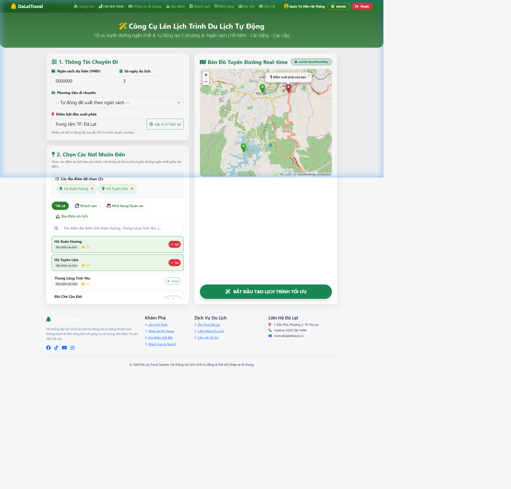 | 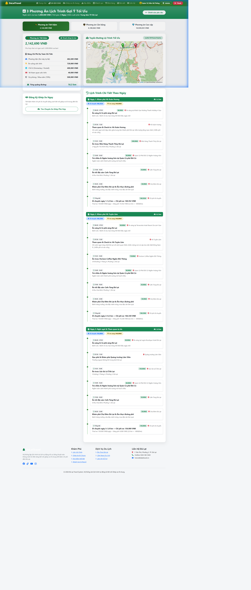 |

---

### 3. 🚗 Nền Tảng Ghép Xe Đi Chung (Carpooling System)
*Kết nối tài xế và du khách có chung lộ trình (TP.HCM, Sân bay Liên Khương, Đà Lạt), hỗ trợ lọc theo tuyến và tiết kiệm chi phí di chuyển.*

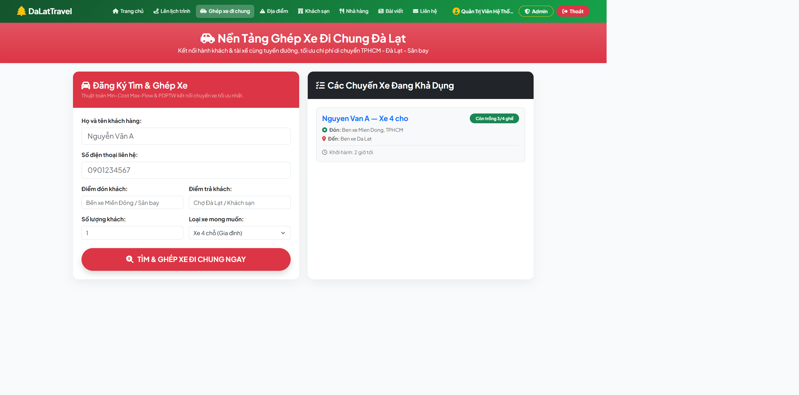

---

### 4. 🏔️ Khám Phá Địa Điểm, Khách Sạn & Nhà Hàng (Discovery Modules)
*Hiển thị 50+ địa điểm tham quan, 10 khách sạn resort và 12 nhà hàng ẩm thực với hình ảnh HD sắc nét, số sao đánh giá và bộ lọc tìm kiếm.*

| 🏞️ Địa Điểm Du Lịch (50+ Spots) | 🏨 Khách Sạn & Resort | 🍲 Nhà Hàng & Quán Ăn |
| :---: | :---: | :---: |
| 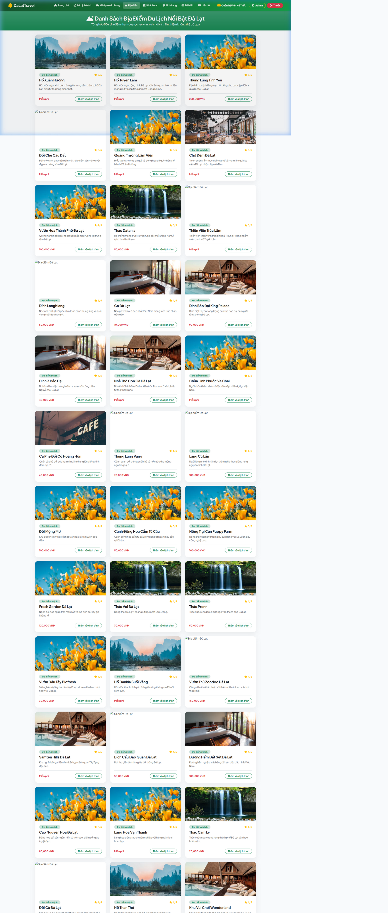 | 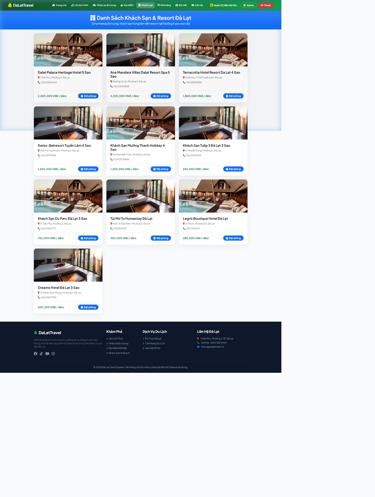 | 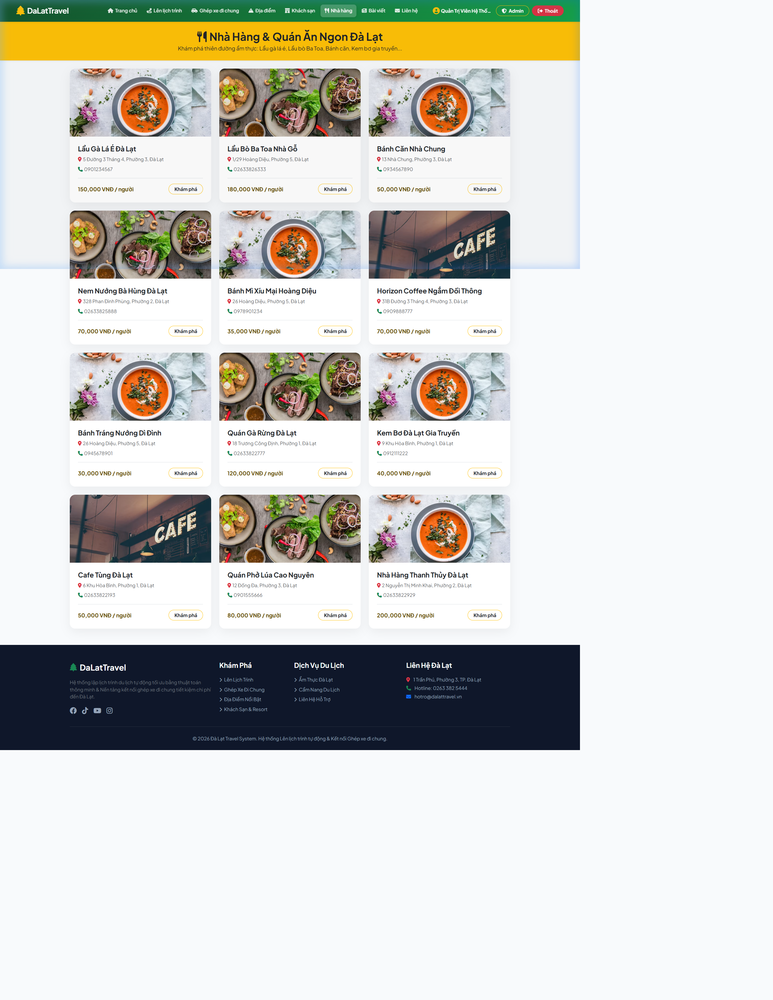 |

---

### 5. 🏨 Chức Năng Đặt Phòng Khách Sạn (Hotel Booking & Instant Calculation)
*Modal đặt phòng trực quan: Chọn ngày Check-in/Check-out, số khách, tự động tính tổng tiền theo đêm và cấp mã đặt phòng duy nhất dạng `DLBK-XXXX`.*

| 📝 Form Modal Đặt Phòng | ✅ Đặt Phòng Thành Công (Code DLBK-XXXX) |
| :---: | :---: |
| 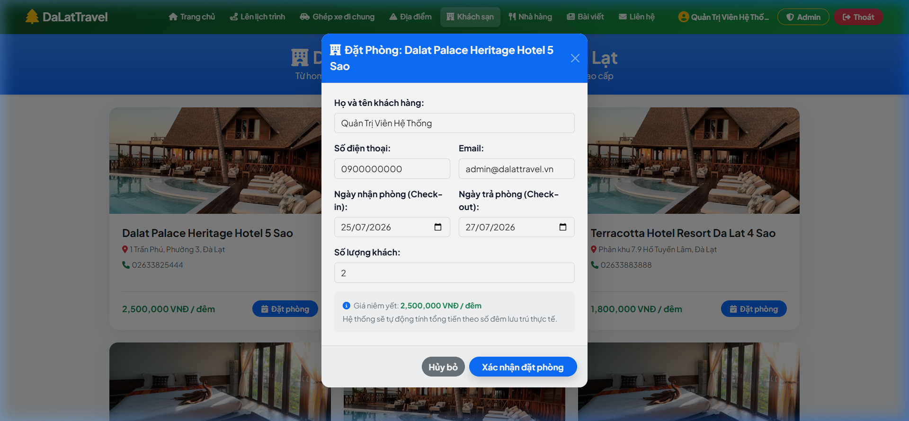 | 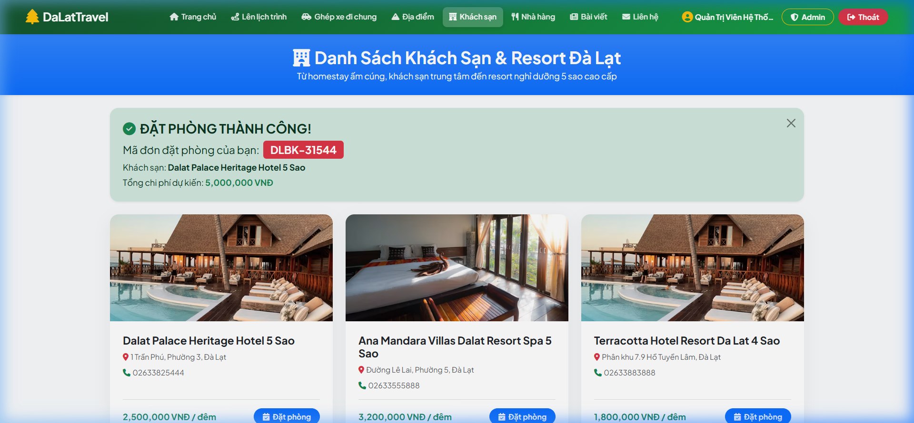 |

---

### 6. 🔐 Đăng Nhập Google OAuth2 & Phân Quyền Admin (Authentication & Security)
*Đăng nhập an toàn bằng Google Identity Services (OAuth2 JWT) hoặc tài khoản thường. Chặn bảo mật `AuthInterceptor` kiểm soát quyền truy cập tài nguyên `/admin`.*

| 🔑 Trang Đăng Nhập & Google Sign-In | 🛡️ Bảng Điều Khiển Admin Dashboard |
| :---: | :---: |
| 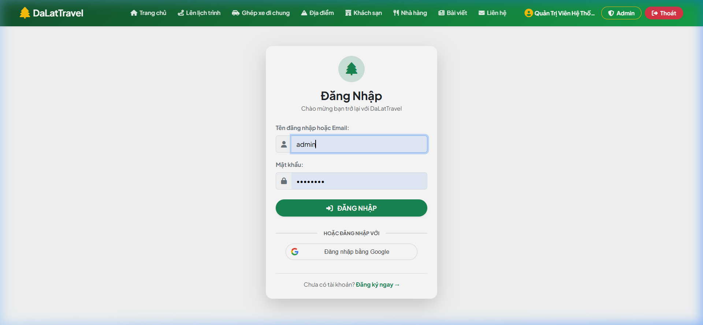 | 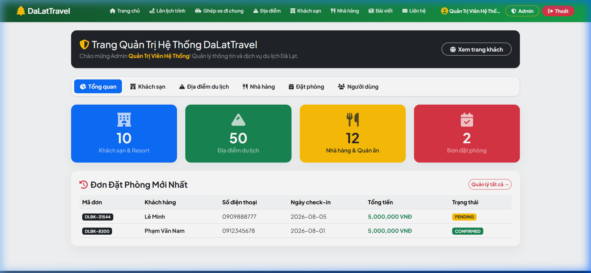 |

| 📋 Duyệt Đơn Đặt Phòng Admin | 🏨 Quản Lý Khách Sạn CRUD | 👥 Phân Quyền Người Dùng (RBAC) |
| :---: | :---: | :---: |
| 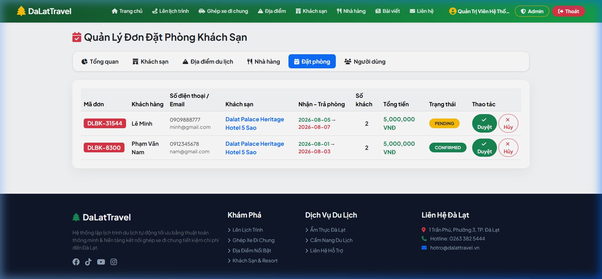 | 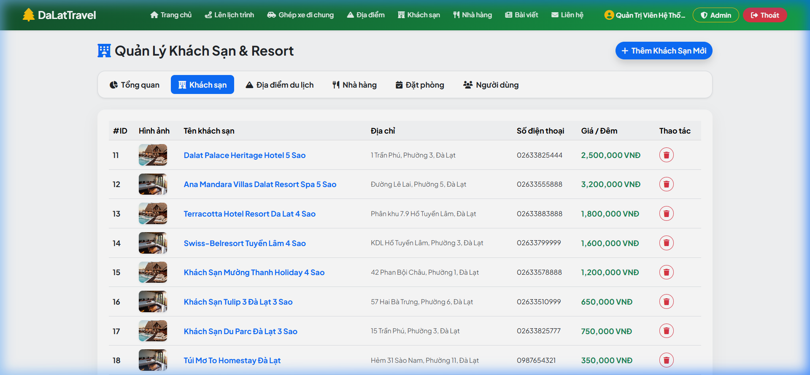 | 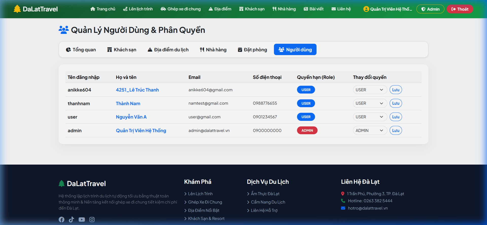 |

---

## 🗄️ THIẾT KẾ CƠ SỞ DỮ LIỆU (DATABASE SCHEMA / ERD)

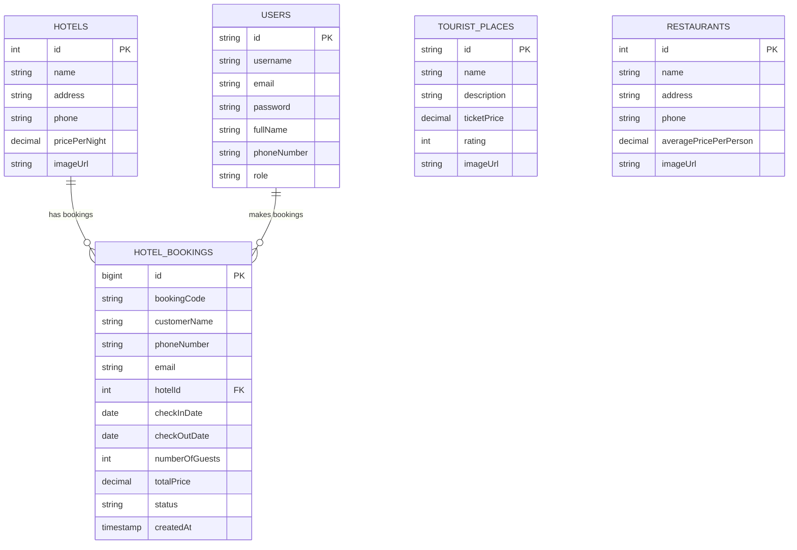

---

## 🛠️ CÔNG NGHỆ & KIẾN TRÚC HỆ THỐNG (TECH STACK & ARCHITECTURE)

- **Backend Core**: Java 21 LTS, Spring Boot 4.1.0, Spring Data JPA, Hibernate ORM.
- **Security & Auth**: Google Identity Services (OAuth2 JWT), SHA-256 Password Hashing, `AuthInterceptor` (Session-based RBAC protection).
- **Algorithms & APIs**: TSP (Traveling Salesman Problem) Greedy Route Optimization, OpenStreetMap OSRM REST Routing API.
- **Frontend & UI**: HTML5, Vanilla CSS, Bootstrap 5.3, FontAwesome 6, LeafletJS Interactive Maps.
- **Database**: MySQL 8.0 với InnoDB, UTF-8 Encoding.
- **Testing Suite**: JUnit 5, Mockito, Maven Test, Playwright / Browser E2E Automation.

---

## 🔑 BIẾN MÔI TRƯỜNG BẢO MẬT & CẤU HÌNH (ENVIRONMENT VARIABLES)

Truyền cấu hình bảo mật thông qua biến môi trường để chống rò rỉ secret lên Git repository:

```bash
export DB_URL="jdbc:mysql://localhost:3306/dalattravel_db?useSSL=false&serverTimezone=UTC&allowPublicKeyRetrieval=true&createDatabaseIfNotExist=true&characterEncoding=UTF-8"
export DB_USERNAME="root"
export DB_PASSWORD="your_secure_db_password"
export GOOGLE_CLIENT_ID="1071806914161-7tjfbvs26pk1n47t89lr14q201djorre.apps.googleusercontent.com"
```

---

## ⚙️ HƯỚNG DẪN CÀI ĐẶT & VẬN HÀNH (SETUP & OPERATION)

### 1. Khởi chạy MySQL Database
Tạo database MySQL:
```sql
CREATE DATABASE dalattravel_db CHARACTER SET utf8mb4 COLLATE utf8mb4_unicode_ci;
```

### 2. Chạy Unit Tests kiểm thử hệ thống
```powershell
.\mvnw.cmd test
```

### 3. Khởi chạy Backend Application (Spring Boot)
```powershell
.\mvnw.cmd spring-boot:run
```

Sau khi server khởi chạy tại `http://localhost:8080`:

### 🔑 Tài Khoản Thử Nghiệm Mẫu (Sample Testing Accounts)

| Vai trò (Role) | Tên đăng nhập (Username) | Mật khẩu mẫu (Password) | Phân quyền & Mục đích kiểm thử |
| :--- | :--- | :--- | :--- |
| **Quản trị viên (Admin)** | `admin` | `admin123` | Quyền Quản trị viên hệ thống (Admin Dashboard, Duyệt đơn đặt phòng, CRUD Khách sạn/Địa điểm/Nhà hàng, Phân quyền RBAC). |
| **Khách hàng mẫu (User)** | `user` | `user123` | Quyền Khách hàng (Lên lịch trình tự động, Ghép xe đi chung, Đặt phòng khách sạn, Đăng nhập Google OAuth2). |

---

## 📁 CẤU TRÚC THƯ MỤC DỰ ÁN (PROJECT STRUCTURE)

```
DaLattravel/
├── docs/screenshots/               # Thư viện 14 ảnh chụp kiểm thử tính năng
├── src/main/java/com/example/dalattravel/
│   ├── config/                     # WebMvcConfig, AuthInterceptor, DataSeeder
│   ├── controller/                 # HomeController, TripPlannerController, HotelController, AdminController, AuthController...
│   ├── model/                      # TouristPlace, Hotel, Restaurant, HotelBooking, User, Carpool...
│   ├── repository/                 # Spring Data JPA Repositories
│   └── service/                    # AuthService, OsrmRouteService, TripPlannerService...
├── src/test/java/com/example/dalattravel/
│   ├── AuthServiceTest.java        # JUnit 5 Unit test cho Auth & Login
│   └── HotelBookingServiceTest.java# JUnit 5 Unit test cho Booking Calculation
├── TEST_PLAN.md                    # Master Test Plan Quy Chuẩn
├── TESTCASES_DALAT_TRAVEL.md       # Full 36 QA Test Cases Suite Matrix
├── testcase hướng dẫn .md          # Tài liệu hướng dẫn kịch bản kiểm thử
├── BUG_REPORT.md                   # Nhật ký theo dõi & quản lý lỗi MantisBT/Jira
└── README.md                       # Tài liệu giới thiệu dự án cho Nhà tuyển dụng
```

---

## 📝 GIẤY PHÉP & TÁC GIẢ (AUTHOR & LICENSE)

- **Đơn vị phát triển**: DaLatTravel Dev & QA Team.
- **Repository**: [https://github.com/buithanhanhvu/DaLattravel.git](https://github.com/buithanhanhvu/DaLattravel.git)
- **Bản quyền**: © 2026 Đà Lạt Travel System. All rights reserved.